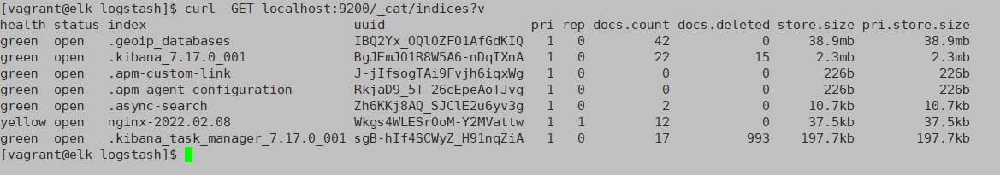
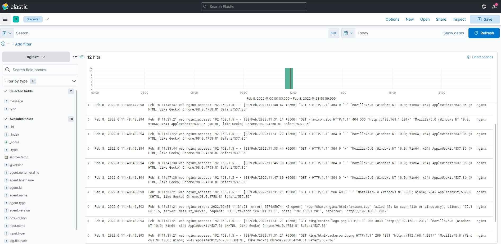

# ELK

## Задачи

В вагранте поднимаем 2 машины web и log
на web поднимаем nginx
на log настраиваем центральный лог сервер на любой системе на выбор
journald
rsyslog
elk
настраиваем аудит следящий за изменением конфигов нжинкса

все критичные логи с web должны собираться и локально и удаленно

все логи с nginx должны уходить на удаленный сервер (локально только критичные)

логи аудита должны также уходить на удаленную систему

развернуть еще машину elk и таким образом настроить 2 центральных лог системы elk И какую либо еще
в elk должны уходить только логи нжинкса
во вторую систему все остальное

## Выполнение

Виртуалки:
###1. web:  192.168.1.201
Установлен nginx и auditd
Весь syslog уходит на 192.168.1.202
Аудит конф. файла nginx так же уходит на 192.168.1.202 с помощью плагина rsyslog.

###2. log: 192.168.1.202
Установлен filebeat и настроен сервер rsyslog
Используя шаблон, в конфигурации rsyslog, разбираем входящие логи по файлам приложений
```
$template RemoteLogs, "/var/log/rsyslog/%HOSTNAME%/%PROGRAMNAME%.log"
*.* ?RemoteLogs
```
filebeat мониторит файлы nginx_access.log и nginx_error.log и отправляет на сервер elk
###3. elk: 192.168.1.203
Установлены logstash, elasticsearch & kibana
logstash принимает, разбирает сообщения и пересылает в DB.
Скриншоты:
Индексы:

kibana



