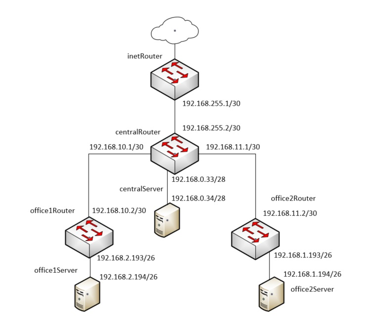

# Архитектура сетей

## Задачи

Построить следующую архитектуру

Сеть office1
- 192.168.2.0/26 - dev
- 192.168.2.64/26 - test servers
- 192.168.2.128/26 - managers
- 192.168.2.192/26 - office hardware

Сеть office2
- 192.168.1.0/25 - dev
- 192.168.1.128/26 - test servers
- 192.168.1.192/26 - office hardware


Сеть central
- 192.168.0.0/28 - directors
- 192.168.0.32/28 - office hardware
- 192.168.0.64/26 - wifi

```
Office1 ---\
-----> Central --IRouter --> internet
Office2----/
```
Итого должны получится следующие сервера
- inetRouter
- centralRouter
- office1Router
- office2Router
- centralServer
- office1Server
- office2Server

### Теоретическая часть
- Найти свободные подсети
- Посчитать сколько узлов в каждой подсети, включая свободные
- Указать broadcast адрес для каждой подсети
- проверить нет ли ошибок при разбиении

### Практическая часть
- Соединить офисы в сеть согласно схеме и настроить роутинг
- Все сервера и роутеры должны ходить в инет черз inetRouter
- Все сервера должны видеть друг друга
- у всех новых серверов отключить дефолт на нат (eth0), который вагрант поднимает для связи
- при нехватке сетевых интервейсов добавить по несколько адресов на интерфейс


## Выполнение

схема сети:


#### Сеть office1

* 192.168.2.0/26	(dev) 			 hosts: 62	broadcast: 192.168.2.63
* 192.168.2.64/26	(test servers) 	 hosts: 62	broadcast: 192.168.2.127
* 192.168.2.128/26	(managers)		 hosts: 62	broadcast: 192.168.2.191
* 192.168.2.192/26	(office hardware)hosts: 62	broadcast: 192.168.2.255

##### Свободных подсетей нет


#### Сеть office2

* 192.168.1.0/25	(dev)				hosts: 126	broadcast: 192.168.1.127
* 192.168.1.128/26 	(test servers)		hosts: 62	broadcast: 192.168.1.191
* 192.168.1.192/26 	(office hardware)	hosts: 62	broadcast: 192.168.1.255

##### Свободных подсетей нет


#### Сеть central

* 192.168.0.0/28	(directors)						hosts: 14 	broadcast: 192.168.0.15
* 192.168.0.32/28	(office hardware)				hosts: 14	broadcast: 192.168.0.47
* 192.168.0.64/26	(wifi)							hosts: 62	broadcast: 192.168.0.127

##### Свободные подсети:

192.168.0.16/28
192.168.0.128/25

#### Служебные подсети

* 192.168.255.0/30	(inetRouter-centralRouter net)	hosts: 2	broadcast: 192.168.255.3
* 192.168.10.0/30	(centralRouter-office1 net)		hosts: 2	broadcast: 192.168.10.3
* 192.168.11.0/30	(centralRouter-office2 net)		hosts: 2	broadcast: 192.168.11.3

#### Тест

Все сервера доступны друг для друга, трафик в интернет проходит через 192.168.255.1 (interRouter).

* centralServer
```
[root@centralServer vagrant]# ping ya.ru -c 2
PING ya.ru (87.250.250.242) 56(84) bytes of data.
64 bytes from ya.ru (87.250.250.242): icmp_seq=1 ttl=52 time=38.8 ms
64 bytes from ya.ru (87.250.250.242): icmp_seq=2 ttl=52 time=41.8 ms

--- ya.ru ping statistics ---
2 packets transmitted, 2 received, 0% packet loss, time 1002ms
rtt min/avg/max/mdev = 38.863/40.334/41.806/1.485 ms
[root@centralServer vagrant]# ping 192.168.2.194 -c 2
PING 192.168.2.194 (192.168.2.194) 56(84) bytes of data.
64 bytes from 192.168.2.194: icmp_seq=1 ttl=62 time=3.01 ms
64 bytes from 192.168.2.194: icmp_seq=2 ttl=62 time=4.91 ms

--- 192.168.2.194 ping statistics ---
2 packets transmitted, 2 received, 0% packet loss, time 1002ms
rtt min/avg/max/mdev = 3.013/3.964/4.916/0.953 ms
[root@centralServer vagrant]# ping 192.168.1.194 -c 2
PING 192.168.1.194 (192.168.1.194) 56(84) bytes of data.
64 bytes from 192.168.1.194: icmp_seq=1 ttl=62 time=2.67 ms
64 bytes from 192.168.1.194: icmp_seq=2 ttl=62 time=4.90 ms

--- 192.168.1.194 ping statistics ---
2 packets transmitted, 2 received, 0% packet loss, time 1002ms
rtt min/avg/max/mdev = 2.675/3.791/4.908/1.118 ms
[root@centralServer vagrant]# traceroute -I ya.ru
traceroute to ya.ru (87.250.250.242), 30 hops max, 60 byte packets
 1  gateway (192.168.0.33)  0.866 ms  0.612 ms  0.736 ms
 2  192.168.255.1 (192.168.255.1)  1.566 ms  0.955 ms  2.885 ms
 3  * * *
 4  * * *
 5  10.0.0.1 (10.0.0.1)  6.196 ms  5.503 ms  5.053 ms
 6  79.104.40.37 (79.104.40.37)  9.985 ms  10.730 ms  10.090 ms
 7  pe03.KK12.Moscow.gldn.net (79.104.235.213)  33.863 ms  32.337 ms  31.276 ms
 8  yandex-gw.moscow.gldn.net (195.239.153.234)  32.453 ms  34.381 ms  34.427 ms
 9  * * *
10  ya.ru (87.250.250.242)  36.119 ms  35.951 ms  36.426 ms
[root@centralServer vagrant]# traceroute -I 192.168.1.194
traceroute to 192.168.1.194 (192.168.1.194), 30 hops max, 60 byte packets
 1  gateway (192.168.0.33)  1.267 ms  0.787 ms  0.521 ms
 2  192.168.11.2 (192.168.11.2)  1.296 ms  1.493 ms  1.956 ms
 3  192.168.1.194 (192.168.1.194)  2.903 ms  5.125 ms  4.811 ms
[root@centralServer vagrant]# traceroute -I 192.168.2.194
traceroute to 192.168.2.194 (192.168.2.194), 30 hops max, 60 byte packets
 1  gateway (192.168.0.33)  0.965 ms  0.443 ms  1.035 ms
 2  192.168.10.2 (192.168.10.2)  10.540 ms  9.994 ms  10.156 ms
 3  192.168.2.194 (192.168.2.194)  17.538 ms  20.221 ms  19.939 ms
```

* office1Server

```
[root@office1Server vagrant]# ping ya.ru -c 2
PING ya.ru (87.250.250.242) 56(84) bytes of data.
64 bytes from ya.ru (87.250.250.242): icmp_seq=1 ttl=51 time=38.0 ms
64 bytes from ya.ru (87.250.250.242): icmp_seq=2 ttl=51 time=38.6 ms

--- ya.ru ping statistics ---
2 packets transmitted, 2 received, 0% packet loss, time 1001ms
rtt min/avg/max/mdev = 38.021/38.348/38.676/0.381 ms
[root@office1Server vagrant]# ping 192.168.0.33 -c 2
PING 192.168.0.33 (192.168.0.33) 56(84) bytes of data.
64 bytes from 192.168.0.33: icmp_seq=1 ttl=63 time=2.21 ms
64 bytes from 192.168.0.33: icmp_seq=2 ttl=63 time=1.56 ms

--- 192.168.0.33 ping statistics ---
2 packets transmitted, 2 received, 0% packet loss, time 1002ms
rtt min/avg/max/mdev = 1.569/1.893/2.218/0.327 ms
[root@office1Server vagrant]# ping 192.168.1.194 -c 2
PING 192.168.1.194 (192.168.1.194) 56(84) bytes of data.
64 bytes from 192.168.1.194: icmp_seq=1 ttl=61 time=3.68 ms
64 bytes from 192.168.1.194: icmp_seq=2 ttl=61 time=3.43 ms

--- 192.168.1.194 ping statistics ---
2 packets transmitted, 2 received, 0% packet loss, time 1002ms
rtt min/avg/max/mdev = 3.439/3.563/3.687/0.124 ms
[root@office1Server vagrant]# tarceroute ya.ru
bash: tarceroute: command not found
[root@office1Server vagrant]# traceroute ya.ru
traceroute to ya.ru (87.250.250.242), 30 hops max, 60 byte packets
 1  gateway (192.168.2.193)  0.991 ms  0.548 ms  1.042 ms
 2  192.168.10.1 (192.168.10.1)  1.682 ms  3.196 ms  10.031 ms
 3  192.168.255.1 (192.168.255.1)  9.984 ms  9.539 ms  8.837 ms

[root@office1Server vagrant]# tarceroute 192.168.0.33
bash: tarceroute: command not found
[root@office1Server vagrant]# traceroute 192.168.0.33
traceroute to 192.168.0.33 (192.168.0.33), 30 hops max, 60 byte packets
 1  gateway (192.168.2.193)  0.859 ms  0.903 ms  0.552 ms
 2  192.168.0.33 (192.168.0.33)  1.281 ms  2.307 ms  2.556 ms
[root@office1Server vagrant]# traceroute 192.168.1.194
traceroute to 192.168.1.194 (192.168.1.194), 30 hops max, 60 byte packets
 1  gateway (192.168.2.193)  1.094 ms  0.526 ms  0.762 ms
 2  192.168.10.1 (192.168.10.1)  16.371 ms  16.723 ms  16.250 ms
 3  192.168.11.2 (192.168.11.2)  16.781 ms  16.296 ms  16.742 ms
 4  192.168.1.194 (192.168.1.194)  16.436 ms  17.374 ms  17.804 ms
```


* office2Server

```
[root@office2Server vagrant]# ping ya.ru -c 2
PING ya.ru (87.250.250.242) 56(84) bytes of data.
64 bytes from ya.ru (87.250.250.242): icmp_seq=1 ttl=51 time=40.3 ms
64 bytes from ya.ru (87.250.250.242): icmp_seq=2 ttl=51 time=37.3 ms

--- ya.ru ping statistics ---
2 packets transmitted, 2 received, 0% packet loss, time 1003ms
rtt min/avg/max/mdev = 37.329/38.856/40.384/1.540 ms
[root@office2Server vagrant]# ping 192.168.0.33 -c 2
PING 192.168.0.33 (192.168.0.33) 56(84) bytes of data.
64 bytes from 192.168.0.33: icmp_seq=1 ttl=63 time=1.60 ms
64 bytes from 192.168.0.33: icmp_seq=2 ttl=63 time=1.60 ms

--- 192.168.0.33 ping statistics ---
2 packets transmitted, 2 received, 0% packet loss, time 1003ms
rtt min/avg/max/mdev = 1.607/1.608/1.609/0.001 ms
[root@office2Server vagrant]# ping 192.168.1.194 -c 2
PING 192.168.1.194 (192.168.1.194) 56(84) bytes of data.
64 bytes from 192.168.1.194: icmp_seq=1 ttl=64 time=0.026 ms
64 bytes from 192.168.1.194: icmp_seq=2 ttl=64 time=0.043 ms

--- 192.168.1.194 ping statistics ---
2 packets transmitted, 2 received, 0% packet loss, time 1003ms
rtt min/avg/max/mdev = 0.026/0.034/0.043/0.010 ms
[root@office2Server vagrant]# traceroute -I ya.ru
traceroute to ya.ru (87.250.250.242), 30 hops max, 60 byte packets
 1  gateway (192.168.1.193)  0.703 ms  1.010 ms  0.776 ms
 2  192.168.11.1 (192.168.11.1)  2.226 ms  2.874 ms  9.048 ms
 3  192.168.255.1 (192.168.255.1)  9.331 ms  8.800 ms  9.364 ms
 4  * * *
 5  * * *
 6  10.0.0.1 (10.0.0.1)  10.525 ms  7.292 ms  7.038 ms
 7  79.104.40.37 (79.104.40.37)  7.466 ms  7.413 ms  6.863 ms
 8  pe03.KK12.Moscow.gldn.net (79.104.235.213)  35.141 ms  33.168 ms  32.941 ms
 9  yandex-gw.moscow.gldn.net (195.239.153.234)  32.485 ms  31.725 ms  36.251 ms
10  * * *
11  ya.ru (87.250.250.242)  41.981 ms  42.042 ms  37.113 ms
[root@office2Server vagrant]# traceroute -I 192.168.0.33
traceroute to 192.168.0.33 (192.168.0.33), 30 hops max, 60 byte packets
 1  gateway (192.168.1.193)  1.137 ms  1.010 ms  0.592 ms
 2  192.168.0.33 (192.168.0.33)  2.410 ms  2.723 ms  2.494 ms
[root@office2Server vagrant]# traceroute -I 192.168.2.194
traceroute to 192.168.2.194 (192.168.2.194), 30 hops max, 60 byte packets
 1  gateway (192.168.1.193)  0.972 ms  0.559 ms  0.588 ms
 2  192.168.11.1 (192.168.11.1)  1.453 ms  1.883 ms  2.212 ms
 3  192.168.10.2 (192.168.10.2)  3.461 ms  6.975 ms  6.333 ms
 4  192.168.2.194 (192.168.2.194)  7.113 ms  9.181 ms  8.759 ms

```


