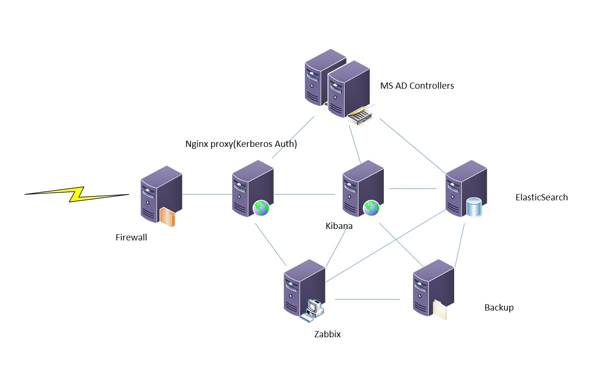

# Project

## Предлагаемый план

На текущем месте работы появилась задача сбора security логов с контроллеров домена.
Было бы очень здорово совместить данную работу с выполнением проекта курса, несмотря на несколько отличающийся профиль предлагаемых работ.
В production варианте не будет firewall, существует инфраструктура AD, все остальное можно будет реализовать по плану проекта. 

Тема проекта - публикация Kibana c авторизацией по Kerberos.
Собираем логи с контроллеров домена на сервер ELK, 
Доступ к интерфейсу Kibana через Nginx-proxy c настроенным модулем kerberos/spnego.
Настроен Firewall, Backup DB Elasticsearch, мониторинг всех компонентов Zabbix.
